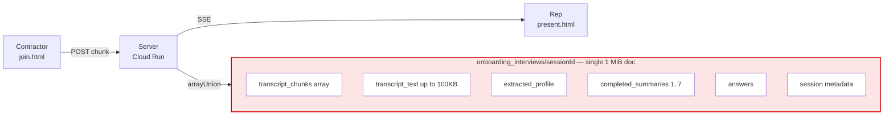
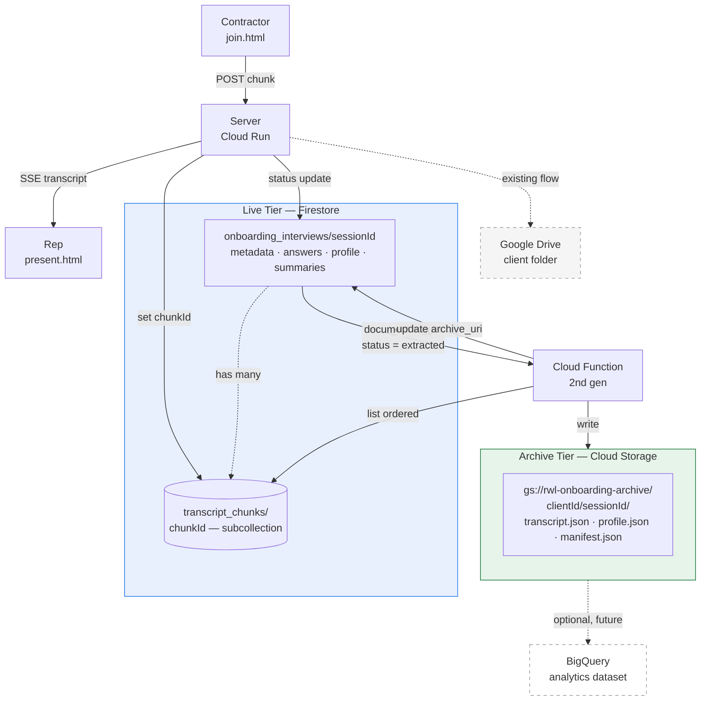
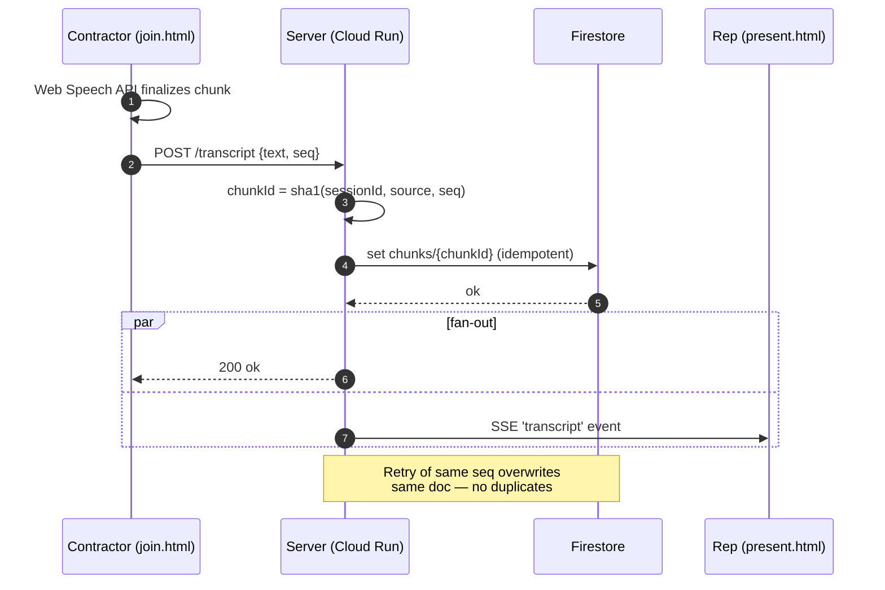
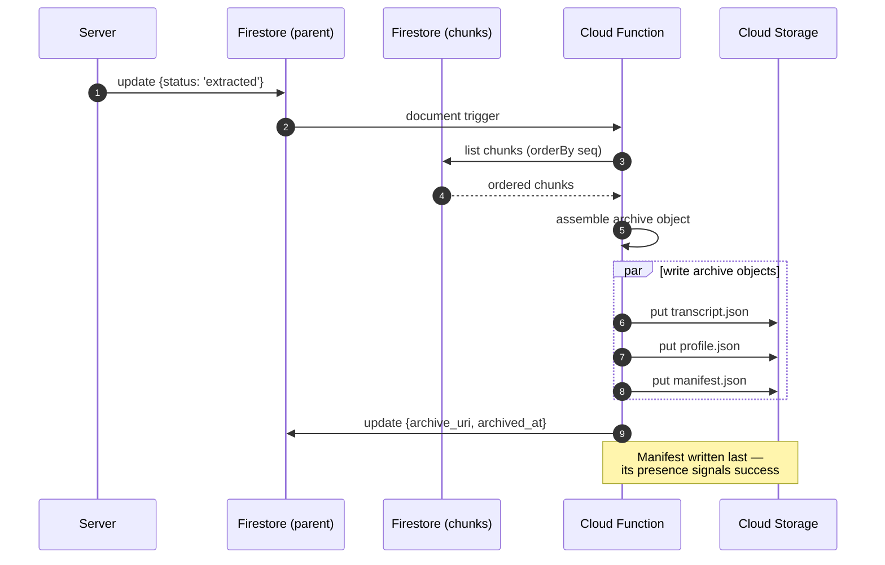
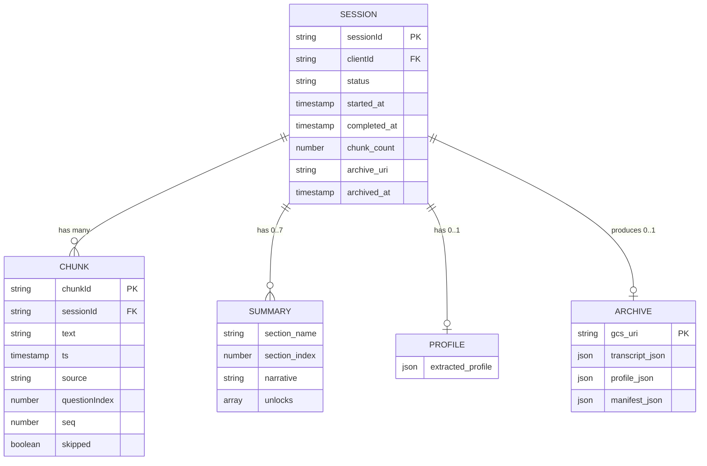
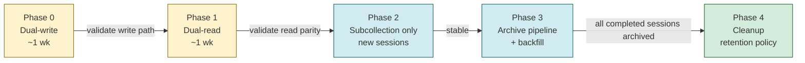

# TRD: Interview Transcript Storage & Archival Pipeline

**Status:** Draft
**Author:** Lara Macario
**Date:** 2026-04-29
**Stack:** GCP (Firestore, Cloud Functions, Cloud Storage, BigQuery)

---

## 1. Background

The onboarding interview product captures live, AI-guided interviews between
RealWork reps and contractor clients. During an interview, contractor speech is
transcribed (Web Speech API client-side; optional Google Cloud Speech-to-Text
server-side via Meet add-on) and streamed in chunks to the server. Each chunk
is appended to a `transcript_chunks` array on a single Firestore document
(`onboarding_interviews/{sessionId}`). The same document also stores session
state, captured Q&A answers, per-section summaries, the final extracted
profile, and a copy of any uploaded raw transcript text.

After an interview completes, a structured profile is generated (Gemini 2.5
Flash) and pushed to Google Drive for downstream rep workflows.

### Current implementation references

- Transcript ingest endpoint — `server.js:6024-6047`
- Skip handler — `server.js:6049-6062`
- Section summary generation — `server.js:5780-5847`
- Profile extraction — `server.js` (`/api/onboarding/sessions/:id/extract`)
- Drive push — `pushOnboardingToDrive()` in `server.js`
- Live state SSE — `/api/onboarding/sessions/:id/stream`

## 2. Problem Statement

The single-document storage model does not scale safely past short interviews
and creates four concrete risks:

1. **1 MiB Firestore document ceiling.** A session document holds
   `transcript_chunks[]`, `transcript_text` (capped at 100 KB),
   `extracted_profile`, `completed_summaries[]` (up to 7), `answers`,
   `section_summary`, plus metadata. A long or chatty interview can approach
   this ceiling; once reached, every subsequent write fails — the live
   interview breaks.
2. **Read amplification.** Every read of the session document pulls the entire
   chunks array, even when a client only needs the latest few chunks or session
   metadata. This grows linearly with interview length.
3. **No idempotency on writes.** Each chunk is appended via
   `FieldValue.arrayUnion`, deduplicated only by exact equality. Because every
   chunk carries a unique `ts`, a network retry produces a duplicate chunk.
4. **Archival coupling.** The "permanent record" of an interview lives in two
   places: Firestore (operational) and Google Drive (human-readable). There is
   no programmatic, structured archive suitable for analytics, retraining, or
   downstream services.

### Current state



Every field shares the same 1 MiB envelope. Read costs grow with interview
length; the chunk array is the dominant contributor.

## 3. Goals

- **G1.** Remove the practical upper bound on transcript length per interview.
- **G2.** Preserve the existing real-time experience: SSE-driven presenter
  view, live contractor progress, ≤ 500 ms end-to-end transcription latency.
- **G3.** Make chunk writes idempotent under retries.
- **G4.** Produce a structured, queryable archive of completed interviews
  suitable for analytics and AI/ML pipelines, separate from the operational
  store.
- **G5.** Stay on the approved GCP stack. No new clouds, no new third-party
  services beyond what is already in use.

## 4. Non-Goals

- Replacing Firestore as the operational store for live session state.
- Changing the AI question/answer flow or the contractor-facing UX.
- Migrating away from Google Drive for rep-facing profile delivery (it
  remains the human handoff surface; archival is additive).
- Real-time analytics on in-flight interviews (post-completion is sufficient).
- Server-side audio recording or storage. (Out of scope; revisit if the Meet
  add-on flow is productized.)

## 5. Requirements

### 5.1 Functional

- **F1.** The system MUST accept transcript chunks of up to 5 000 characters
  with a per-session ingest rate of at least 30 chunks/min sustained.
- **F2.** Chunks MUST be retrievable in arrival order, filterable by
  `questionIndex`, with pagination.
- **F3.** Each chunk MUST have a stable, client-derivable identifier so that
  retries do not produce duplicates.
- **F4.** When an interview transitions to `extracted` status, a complete
  archival record MUST be written to Cloud Storage within 60 seconds and MUST
  contain: full ordered transcript, captured answers, extracted profile,
  section summaries, and session metadata.
- **F5.** The presenter view (`present.html`) and rep onboarding view
  (`onboarding.html`) MUST continue to receive transcript and summary updates
  via SSE with no user-visible change.
- **F6.** A completed archive MUST be queryable for analytics (interview
  count, duration, section completion rate, profile field coverage) without
  reading from Firestore.

### 5.2 Non-Functional

- **NFR1. Latency.** End-to-end chunk delivery (contractor speech finalized →
  presenter screen) ≤ 500 ms p95.
- **NFR2. Durability.** Archive writes MUST be durable (GCS multi-region or
  dual-region bucket) with a 30-day soft-delete / object versioning window.
- **NFR3. Cost.** Per-interview storage + compute cost MUST NOT exceed the
  current per-interview cost by more than 25% at steady state. Live
  Firestore costs SHOULD decrease.
- **NFR4. Security.** Live transcript data is treated as PII. Operational
  data in Firestore follows existing rules. Archive bucket MUST be private,
  uniform-bucket-level-access, with reads gated through the application
  service account or signed URLs only.
- **NFR5. Observability.** Failed archive writes MUST produce a Cloud Logging
  error and an alert. Firestore document-size approaching limit MUST be
  monitored.
- **NFR6. Data residency.** All storage stays in GCP regions consistent with
  existing Firestore region.

## 6. Proposed Architecture



### 6.1 Live tier — Firestore subcollection

Move chunk storage from a parent-doc array to a subcollection:

```
onboarding_interviews/{sessionId}                  ← unchanged
onboarding_interviews/{sessionId}/transcript_chunks/{chunkId}   ← NEW
```

Each chunk document holds: `text`, `ts`, `source`, `questionIndex`, `skipped`,
`seq` (monotonic per session). The `chunkId` is a deterministic hash of
`(sessionId, source, seq)` so retries collapse to the same document ID.



### 6.2 Archive tier — Cloud Storage

A Firestore document trigger (Cloud Function, 2nd gen) fires on
`onboarding_interviews/{sessionId}` when `status` transitions to `extracted`.
The function:

1. Reads the chunks subcollection in order.
2. Composes a canonical archive (`transcript.json`, `profile.json`,
   `manifest.json`).
3. Writes to GCS at `gs://rwl-onboarding-archive/{clientId}/{sessionId}/`.
4. Updates the parent doc with `archive_uri` and `archived_at`.
5. (Optional) Emits a row to BigQuery for analytics.

GCS is the system of record for completed interviews. Firestore retains
operational data; chunks subcollection MAY be retained for a configurable
window (e.g. 90 days) and then garbage-collected.



### 6.3 Drive integration

Unchanged. The existing `pushOnboardingToDrive()` continues to write the
human-readable profile to the client's Drive folder for rep handoff.

## 7. Data Model Changes




### Parent document (additive only)

```
onboarding_interviews/{sessionId}
  ...existing fields...
  transcript_chunks: REMOVED         ← migrated to subcollection
  contractor_interim: unchanged       ← still on parent
  archive_uri: string | null          ← NEW (gs:// URI)
  archived_at: Timestamp | null       ← NEW
  chunk_count: number                 ← NEW (denormalized for fast reads)
```

### Chunk subcollection document

```
onboarding_interviews/{sessionId}/transcript_chunks/{chunkId}
  text: string (≤ 5000 chars)
  ts: ISO timestamp
  source: 'contractor' | 'rep' | 'system'
  questionIndex: number
  seq: number                         ← monotonic per session
  skipped?: boolean
  interim?: boolean                   ← only persisted for non-interim
```

### Archive object (`transcript.json`)

```
{
  "schema_version": 1,
  "session_id": "...",
  "client_id": "...",
  "client_name": "...",
  "started_at": "...",
  "completed_at": "...",
  "questions": [
    {
      "question_id": "origin_1",
      "section": "Origin Story",
      "label": "...",
      "answer": "...",
      "skipped": false,
      "chunks": [{ "ts": "...", "text": "..." }]
    }
  ],
  "section_summaries": [...],
  "extracted_profile": {...}
}
```

## 8. Migration & Rollout

Phased, behind a feature flag (`TRANSCRIPT_SUBCOLLECTION_ENABLED`). New
sessions opt in; in-flight sessions complete on the legacy path.



Rollback gates: each phase has a kill switch that reverts to the previous
phase's behavior without data loss. Phases 0–1 are reversible at any time;
phase 2 is reversible until phase 4 starts cleanup.

1. **Phase 0 — Dual-write (1 week).** Server writes chunks to both array and
   subcollection. Reads still use array. Validates write path under load.
2. **Phase 1 — Dual-read (1 week).** Reads switch to subcollection; array
   retained as fallback. Compare counts, alert on drift.
3. **Phase 2 — Subcollection only (new sessions).** Stop writing the array on
   new sessions. Existing in-flight sessions finish on legacy path.
4. **Phase 3 — Archive pipeline.** Enable the Cloud Function trigger. Backfill
   completed sessions in batches.
5. **Phase 4 — Cleanup.** Remove array-write code; schedule chunk
   subcollection retention policy.

Backfill is bounded: only completed `onboarding_interviews` from the last 12
months are archived. Older sessions remain queryable in Firestore.

## 9. Risks & Mitigations

| Risk | Mitigation |
|------|------------|
| Chunk subcollection write latency higher than array append | Benchmark in Phase 0; chunks are tiny (< 1 KB) so expected to be comparable. |
| SSE flow regression | SSE broadcast already happens in the request handler, independent of storage shape. Phase 1 read switch is the only at-risk change. |
| Archive Function failure goes unnoticed | DLQ + Cloud Logging alert on `severity=ERROR`. Manifest write is the last step, so absence indicates failure. |
| Cost regression from Cloud Function invocations | Function fires once per completed interview (bounded ≈ tens/day). Negligible vs Firestore savings. |
| PII leak via archive bucket | Uniform bucket-level access, private by default, signed-URL reads, IAM audit logging on. |
| Backfill overwhelms Firestore | Backfill runs in a Cloud Run job with a token-bucket rate limiter; batch size tunable. |

## 10. Open Questions

- **OQ1.** Should chunk subcollection have a TTL (e.g. 90 days post-archive),
  or be retained indefinitely? Affects long-tail Firestore cost.
- **OQ2.** Do we want BigQuery integration in v1, or defer to a follow-up RFC?
- **OQ3.** Should Drive push remain server-side (current) or move into the
  same Cloud Function as GCS archival, to centralize completion side-effects?
- **OQ4.** What is the right archive bucket region — match Firestore, or
  multi-region for durability?
- **OQ5.** Is signed-URL access sufficient for analyst/AI consumers, or do we
  need a thin read API in front of GCS?

## 11. RFC Breakdown

This TRD will be decomposed into the following RFCs, sequenced for delivery:

```mermaid
flowchart TB
    TRD([TRD: Transcript Pipeline]):::trd

    TRD --> R1[RFC-001<br/>Chunk subcollection]:::core
    TRD --> R2[RFC-002<br/>Archive Cloud Function + GCS]:::core
    TRD --> R3[RFC-003<br/>Backfill job]:::core
    TRD -.-> R4[RFC-004 (optional)<br/>BigQuery analytics]:::opt
    TRD -.-> R5[RFC-005 (optional)<br/>Archive read API]:::opt

    R1 --> R2
    R2 --> R3
    R3 -.-> R4
    R2 -.-> R5

    classDef trd fill:#e8f0fe,stroke:#1a73e8,stroke-width:2px
    classDef core fill:#d4edda,stroke:#155724
    classDef opt fill:#f5f5f5,stroke:#999,stroke-dasharray: 5 5
```

- **RFC-001:** Transcript chunk subcollection — schema, ingest, dual-write,
  read switch. Covers §6.1, §7 (chunk doc), §8 phases 0–2.
- **RFC-002:** Archive Cloud Function & GCS layout — trigger, archive object
  shape, bucket configuration, IAM. Covers §6.2, §7 (archive object), §8
  phase 3.
- **RFC-003:** Backfill job — historical session archival, rate limiting,
  resumability. Covers §8 phase 3 backfill.
- **RFC-004 (optional):** BigQuery analytics integration — schema, load
  cadence, dashboards. Covers OQ2.
- **RFC-005 (optional):** Read API for archives — if signed URLs are
  insufficient. Covers OQ5.

## 12. Success Metrics

- Zero `1 MiB document` errors on `onboarding_interviews` writes for 30 days
  post-rollout.
- p95 chunk-to-presenter latency unchanged (±10%) vs baseline.
- 100% of completed interviews have an `archive_uri` within 60 s of
  `extracted` status.
- Per-interview Firestore read cost reduced by ≥ 40% (driven by no longer
  reading the full chunks array on every state fetch).
