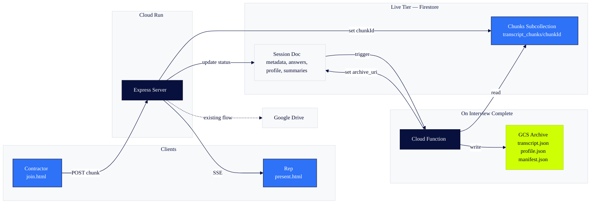
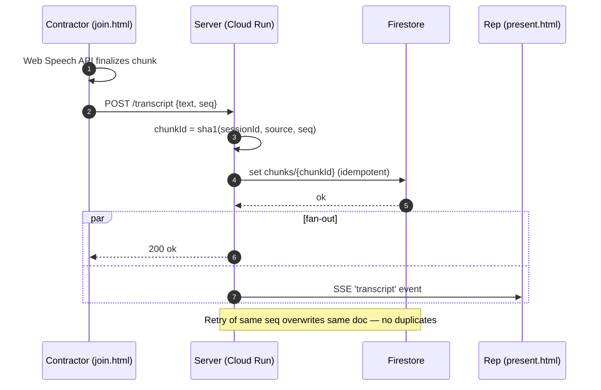
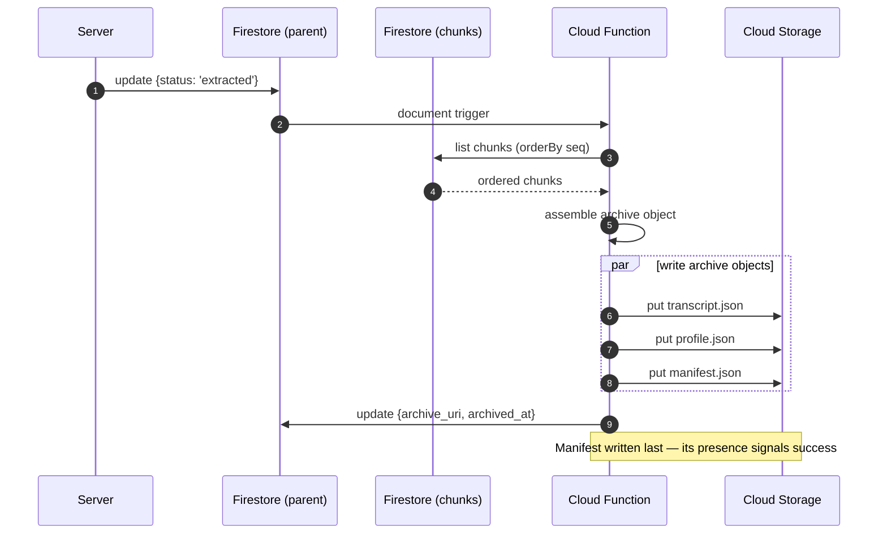
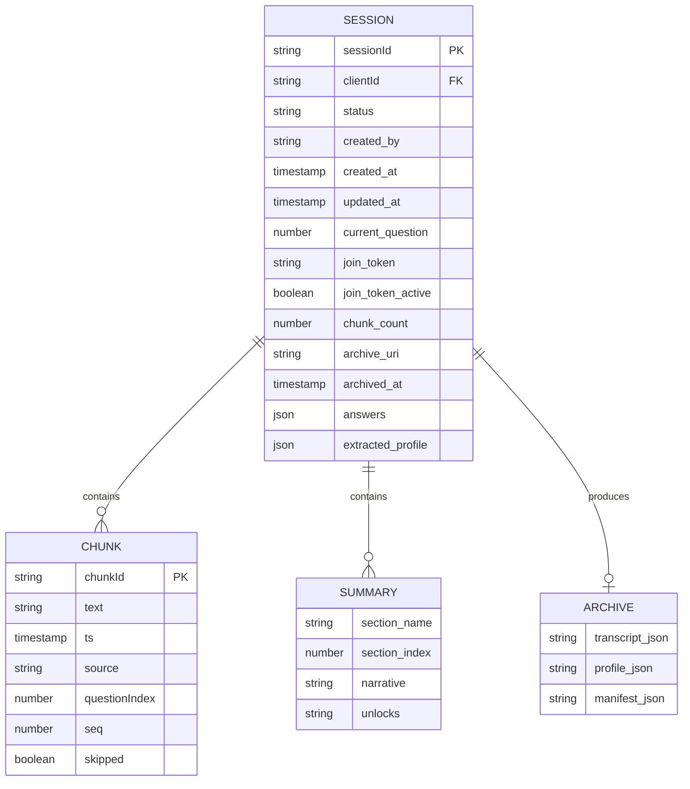
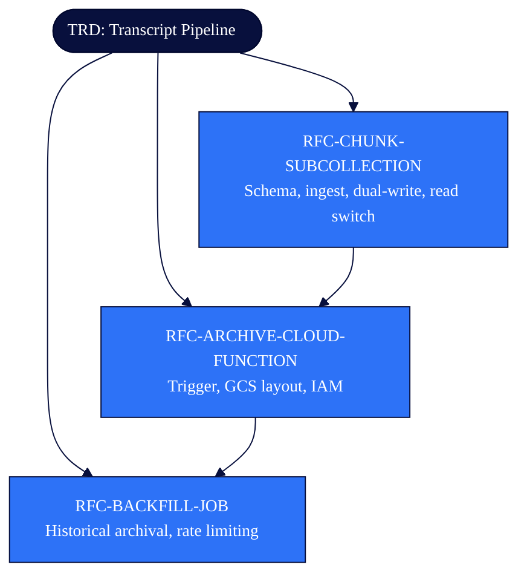

# Transcript Pipeline

## Technical Motivation

The onboarding interview product captures live, AI-guided interviews between RealWork reps and contractor clients. Contractor speech is transcribed (Web Speech API client-side; optional Google Cloud Speech-to-Text server-side via Meet add-on) and streamed in chunks to the server. Each chunk is appended to a `transcript_chunks` array on a single Firestore document (`onboarding_interviews/{sessionId}`). The same document stores session state, captured Q&A answers, per-section summaries, the final extracted profile, and a copy of any uploaded raw transcript text.

After an interview completes, a structured profile is extracted via Gemini 2.5 Flash and pushed to Google Drive for downstream rep workflows.

The single-document storage model does not scale safely past short interviews and creates four concrete risks:

1. **1 MiB Firestore document ceiling.** A session document holds `transcript_chunks[]`, `transcript_text` (capped at 100 KB), `extracted_profile`, `completed_summaries[]` (up to 7), `answers`, `section_summary`, plus metadata. A long or chatty interview can approach this ceiling; once reached, every subsequent write fails and the live interview breaks.
2. **Read amplification.** Every read of the session document pulls the entire chunks array, even when a client only needs the latest few chunks or session metadata. Cost grows linearly with interview length.
3. **No idempotency on writes.** Each chunk is appended via `FieldValue.arrayUnion`, deduplicated only by exact equality. Because every chunk carries a unique `ts`, a network retry produces a duplicate chunk.
4. **Archival coupling.** The permanent record of an interview lives in two places: Firestore (operational) and Google Drive (human-readable). There is no programmatic, structured archive suitable for analytics, retraining, or downstream services.

### Current state

```mermaid
%%{init: {'theme':'base','themeVariables':{'primaryColor':'#F8F9FB','primaryTextColor':'#00072D','primaryBorderColor':'#2D72F7','secondaryColor':'#F8F9FB','secondaryTextColor':'#00072D','secondaryBorderColor':'#DFE1E7','tertiaryColor':'#F8F9FB','tertiaryTextColor':'#00072D','tertiaryBorderColor':'#DFE1E7','lineColor':'#08103D','textColor':'#00072D','clusterBkg':'#F8F9FB','clusterBorder':'#DFE1E7','titleColor':'#08103D','edgeLabelBackground':'#FFFFFF','fontFamily':'Inter, Plus Jakarta Sans, sans-serif','fontSize':'14px'}}}%%

flowchart LR
    Contractor["Contractor<br/>join.html"]:::primary -->|POST chunk| Server["Server<br/>Cloud Run"]:::primary
    Server -->|arrayUnion| Doc
    Server -->|SSE| Rep["Rep<br/>present.html"]:::primary

    subgraph Doc["onboarding_interviews/sessionId — single 1 MiB doc"]
        direction TB
        chunks["transcript_chunks array"]:::error
        text["transcript_text up to 100KB"]:::neutral
        profile["extracted_profile"]:::neutral
        summaries["completed_summaries 1..7"]:::neutral
        answers["answers"]:::neutral
        meta["session metadata"]:::neutral
    end

    classDef primary fill:#2D72F7,stroke:#08103D,color:#FFFFFF
    classDef dark    fill:#08103D,stroke:#00072D,color:#FFFFFF
    classDef accent  fill:#CFFF04,stroke:#B5DD08,color:#00072D
    classDef neutral fill:#F8F9FB,stroke:#DFE1E7,color:#00072D
    classDef error   fill:#FF443D,stroke:#FF443D,color:#FFFFFF
```



Every field shares the same 1 MiB envelope. Read costs grow with interview length; the chunk array is the dominant contributor.

### Current implementation references

- Transcript ingest endpoint — `server.js:6024-6047`
- Skip handler — `server.js:6049-6062`
- Section summary generation — `server.js:5780-5847`
- Profile extraction — `server.js` (`/api/onboarding/sessions/:id/extract`)
- Drive push — `pushOnboardingToDrive()` in `server.js`
- Live state SSE — `/api/onboarding/sessions/:id/stream`

## Goals

- Remove the practical upper bound on transcript length per interview.
- Preserve the existing real-time experience: SSE-driven presenter view, live contractor progress, ≤ 500 ms end-to-end transcription latency.
- Make chunk writes idempotent under retries.
- Produce a structured, queryable archive of completed interviews suitable for analytics and AI/ML pipelines, separate from the operational store.
- Stay on the approved GCP stack. No new clouds, no new third-party services.

## Requirements

### Functional

- The system MUST accept transcript chunks of up to 5 000 characters with a per-session ingest rate of at least 30 chunks/min sustained.
- Chunks MUST be retrievable in arrival order, filterable by `questionIndex`, with pagination.
- Each chunk MUST have a stable, client-derivable identifier so that retries do not produce duplicates.
- When an interview transitions to `extracted` status, a complete archival record MUST be written to Cloud Storage within 60 seconds and MUST contain: full ordered transcript, captured answers, extracted profile, section summaries, and session metadata.
- The presenter view (`present.html`) and rep onboarding view (`onboarding.html`) MUST continue to receive transcript and summary updates via SSE with no user-visible change.
- A completed archive MUST be queryable for analytics (interview count, duration, section completion rate, profile field coverage) without reading from Firestore.

### Non-Functional

- **Latency.** End-to-end chunk delivery (contractor speech finalized to presenter screen) ≤ 500 ms p95.
- **Durability.** Archive writes MUST be durable (GCS region matching Firestore) with a 30-day soft-delete / object versioning window.
- **Cost.** Per-interview storage + compute cost MUST NOT exceed the current per-interview cost by more than 25% at steady state. Live Firestore costs SHOULD decrease.
- **Security.** Live transcript data is treated as PII. Archive bucket MUST be private, uniform-bucket-level-access, with reads gated through the application service account or signed URLs.
- **Observability.** Failed archive writes MUST produce a Cloud Logging error and an alert. Firestore document-size approaching limit MUST be monitored.
- **Data residency.** All storage stays in GCP regions consistent with existing Firestore region.

## Scope

### In Scope

- Firestore subcollection for live transcript chunks with idempotent writes.
- GCS archive tier via Cloud Function trigger on interview completion.
- Phased migration with dual-write/dual-read and feature flag.
- Backfill of completed sessions from the last 12 months.
- 90-day retention policy on chunk subcollection documents post-archive.
- Drive push remains server-side (unchanged).

### Out of Scope

- Replacing Firestore as the operational store for live session state.
- Changing the AI question/answer flow or the contractor-facing UX.
- Migrating away from Google Drive for rep-facing profile delivery.
- Real-time analytics on in-flight interviews (post-completion is sufficient).
- Server-side audio recording or storage.
- BigQuery integration (deferred to future initiative if needed).

## Architecture



### Live tier — Firestore subcollection

Move chunk storage from a parent-doc array to a subcollection:

```
onboarding_interviews/{sessionId}                                ← unchanged
onboarding_interviews/{sessionId}/transcript_chunks/{chunkId}    ← NEW
```

Each chunk document holds: `text`, `ts`, `source`, `questionIndex`, `skipped`, `seq` (monotonic per session). The `chunkId` is a deterministic hash of `(sessionId, source, seq)` so retries collapse to the same document ID.



### Archive tier — Cloud Storage

A Firestore document trigger (Cloud Function, 2nd gen) fires on `onboarding_interviews/{sessionId}` when `status` transitions to `extracted`. The function:

1. Reads the chunks subcollection in order.
2. Composes a canonical archive (`transcript.json`, `profile.json`, `manifest.json`).
3. Writes to GCS at `gs://rwl-onboarding-archive/{clientId}/{sessionId}/`.
4. Updates the parent doc with `archive_uri` and `archived_at`.

GCS is the system of record for completed interviews. Firestore retains operational data; chunks subcollection is retained for 90 days post-archive, then garbage-collected.



### Drive integration

Unchanged. The existing `pushOnboardingToDrive()` continues to write the human-readable profile to the client's Drive folder for rep handoff.

## Data Model



### Parent document (additive only)

```
onboarding_interviews/{sessionId}
  ...existing fields...
  transcript_chunks: REMOVED         ← migrated to subcollection
  contractor_interim: unchanged       ← still on parent
  archive_uri: string | null          ← NEW (gs:// URI)
  archived_at: Timestamp | null       ← NEW
  chunk_count: number                 ← NEW (denormalized for fast reads)
```

### Chunk subcollection document

```
onboarding_interviews/{sessionId}/transcript_chunks/{chunkId}
  text: string (max 5000 chars)
  ts: ISO timestamp
  source: 'contractor' | 'rep' | 'system'
  questionIndex: number
  seq: number                         ← monotonic per session
  skipped?: boolean
  interim?: boolean                   ← only persisted for non-interim
```

### Archive object (transcript.json)

```json
{
  "schema_version": 1,
  "session_id": "...",
  "client_id": "...",
  "client_name": "...",
  "started_at": "...",
  "completed_at": "...",
  "questions": [
    {
      "question_id": "origin_1",
      "section": "Origin Story",
      "label": "...",
      "answer": "...",
      "skipped": false,
      "chunks": [{ "ts": "...", "text": "..." }]
    }
  ],
  "section_summaries": [],
  "extracted_profile": {}
}
```

## Migration and Rollout

Phased, behind a feature flag (`TRANSCRIPT_SUBCOLLECTION_ENABLED`). New sessions opt in; in-flight sessions complete on the legacy path.

```mermaid
%%{init: {'theme':'base','themeVariables':{'primaryColor':'#F8F9FB','primaryTextColor':'#00072D','primaryBorderColor':'#2D72F7','secondaryColor':'#F8F9FB','secondaryTextColor':'#00072D','secondaryBorderColor':'#DFE1E7','tertiaryColor':'#F8F9FB','tertiaryTextColor':'#00072D','tertiaryBorderColor':'#DFE1E7','lineColor':'#08103D','textColor':'#00072D','clusterBkg':'#F8F9FB','clusterBorder':'#DFE1E7','titleColor':'#08103D','edgeLabelBackground':'#FFFFFF','fontFamily':'Inter, Plus Jakarta Sans, sans-serif','fontSize':'14px'}}}%%

flowchart LR
    P0["Phase 0<br/>Dual-write<br/>~1 wk"]:::neutral -->|validate write path| P1["Phase 1<br/>Dual-read<br/>~1 wk"]:::neutral
    P1 -->|validate read parity| P2["Phase 2<br/>Subcollection only<br/>new sessions"]:::primary
    P2 -->|stable| P3["Phase 3<br/>Archive pipeline<br/>+ backfill"]:::primary
    P3 -->|all completed sessions archived| P4["Phase 4<br/>Cleanup<br/>retention policy"]:::accent

    classDef primary fill:#2D72F7,stroke:#08103D,color:#FFFFFF
    classDef dark    fill:#08103D,stroke:#00072D,color:#FFFFFF
    classDef accent  fill:#CFFF04,stroke:#B5DD08,color:#00072D
    classDef neutral fill:#F8F9FB,stroke:#DFE1E7,color:#00072D
```



Rollback gates: each phase has a kill switch that reverts to the previous phase's behavior without data loss. Phases 0-1 are reversible at any time; phase 2 is reversible until phase 4 starts cleanup.

1. **Phase 0 — Dual-write (1 week).** Server writes chunks to both array and subcollection. Reads still use array. Validates write path under load.
2. **Phase 1 — Dual-read (1 week).** Reads switch to subcollection; array retained as fallback. Compare counts, alert on drift.
3. **Phase 2 — Subcollection only (new sessions).** Stop writing the array on new sessions. Existing in-flight sessions finish on legacy path.
4. **Phase 3 — Archive pipeline.** Enable the Cloud Function trigger. Backfill completed sessions in batches.
5. **Phase 4 — Cleanup.** Remove array-write code; apply 90-day chunk subcollection retention policy.

Backfill is bounded: only completed `onboarding_interviews` from the last 12 months are archived. Older sessions remain queryable in Firestore.

## Risks and Mitigations

| Risk | Mitigation |
|------|------------|
| Chunk subcollection write latency higher than array append | Benchmark in Phase 0; chunks are tiny (< 1 KB) so expected to be comparable. |
| SSE flow regression | SSE broadcast already happens in the request handler, independent of storage shape. Phase 1 read switch is the only at-risk change. |
| Archive Function failure goes unnoticed | DLQ + Cloud Logging alert on `severity=ERROR`. Manifest write is the last step, so absence indicates failure. |
| Cost regression from Cloud Function invocations | Function fires once per completed interview (bounded to tens/day). Negligible vs Firestore savings. |
| PII leak via archive bucket | Uniform bucket-level access, private by default, signed-URL reads, IAM audit logging on. |
| Backfill overwhelms Firestore | Backfill runs in a Cloud Run job with a token-bucket rate limiter; batch size tunable. |

## Success Criteria

- Zero `1 MiB document` errors on `onboarding_interviews` writes for 30 days post-rollout.
- p95 chunk-to-presenter latency unchanged (within 10%) vs baseline.
- 100% of completed interviews have an `archive_uri` within 60 seconds of `extracted` status.
- Per-interview Firestore read cost reduced by at least 40% (driven by no longer reading the full chunks array on every state fetch).

## RFC Decomposition



- **RFC-CHUNK-SUBCOLLECTION:** Transcript chunk subcollection — schema, ingest endpoint changes, dual-write/dual-read migration, feature flag. Covers live tier architecture, chunk data model, migration phases 0-2.
- **RFC-ARCHIVE-CLOUD-FUNCTION:** Archive Cloud Function and GCS layout — Firestore document trigger, archive object schema, bucket configuration, IAM, signed-URL access. Covers archive tier architecture, archive data model, migration phase 3.
- **RFC-BACKFILL-JOB:** Backfill job for historical sessions — Cloud Run job, rate limiting, resumability, bounded to last 12 months. Covers migration phase 3 backfill and phase 4 cleanup.

## Open Questions

None. All questions resolved:

| Question | Resolution |
|----------|-----------|
| Chunk subcollection TTL | 90 days post-archive. |
| BigQuery integration in v1 | No. Deferred to future initiative. |
| Drive push placement | Stays server-side. Revisit if consolidation makes sense later. |
| Archive bucket region | Match Firestore region. |
| Archive read mechanism | Signed URLs are sufficient. No read API needed. |
